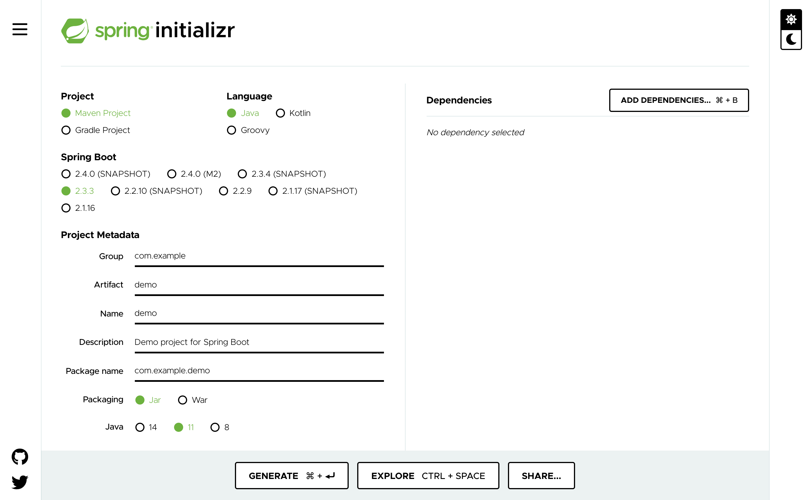

The first thing we need to do is create a Spring Boot application. We are going to look at three different ways you can quickly create a new Spring Boot application from scratch.

The first method is to use the **spring initialzr** site at [start.spring.io](https://start.spring.io/).



The purpose of the web site is to allow you to enter in details about the Spring Boot application you want to create. This includes the name of the application, the tooling you want to use, and any dependencies. When you click on generate it will automatically start a download of application source code for a Spring Boot application satisfying those requirements. You can then unpack that on your local computer and start working.

We will not be using this method because if used it will download the resulting application to your local computer, rather than this workshop environment. So great for when you do want to get started on your own machine, but not so here.

Although we can't use the web interface for start.spring.io to create the application for this workshop, the web site does provide an alternate way of creating an application through a REST API service. The REST API can be used directly, or via other front end interfaces.

The second method you can use, if you use the VS Code editor, is to use the [spring initialzr extension](https://github.com/microsoft/vscode-spring-initializr) for VS code. This extension calls out to the REST API to download the application code.

You can find and install this extension by searching for "Initializr" in the VS Code extensions manager. In this workshop environment we already have the extension installed as part of the embedded VS Code editor, so there is no need to install it.

To make use of the extension you would bring up the VS Code command pallete and search for "Spring Initializr", and select the desired command, depending on whether you want to use Maven or Gradle.

In this workshop environment we have semi automated this process, filling in some default parameters, so you can see how it works. Click on the following action block to start off the process.

```editor:execute-command
command: spring.initializr.maven-project
args:
- language: Java
  dependencies: [ "actuator", "webflux" ]
  artifactId: demo
  groupId: com.example
```

When the command popup appears in the editor on the right, accept all the defaults.

You will note that in this case we specified that we wanted the `webflux` and `actuator` modules listed as dependencies.

At the end the application code will be generated into the editor workspace.

> NOTE: The Spring Initializr extension will usually also prompt for a folder to download and unzip the generated files at the end of its multi-step workflow. The extension used in this workshop has been configured to do this automatically, using the workshop `~/exercises/demo` folder as the target.

The REST API can also be used directly from the command line by making a request against the URL `https://start.spring.io/starter.tgz`, supplying HTTP POST parameters describing the details for your application.

For our third method we will use `curl` to do this, and then unpack it. Run the command:

```execute
rm -rf demo && mkdir -p demo && (cd demo; curl -s https://start.spring.io/starter.tgz -d dependencies=webflux,actuator | tar -xzvf -)
```

You will again note that we specified that we wanted the `webflux` and `actuator` modules listed as dependencies.

You can see the result by running:

```execute
tree demo
```

To verify that the application code has been generated successfully, open up the main Java source code file for the application.

```editor:open-file
file: ~/exercises/demo/src/main/java/com/example/demo/DemoApplication.java
```
